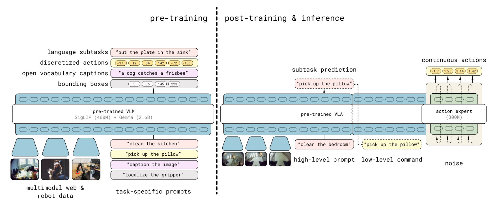
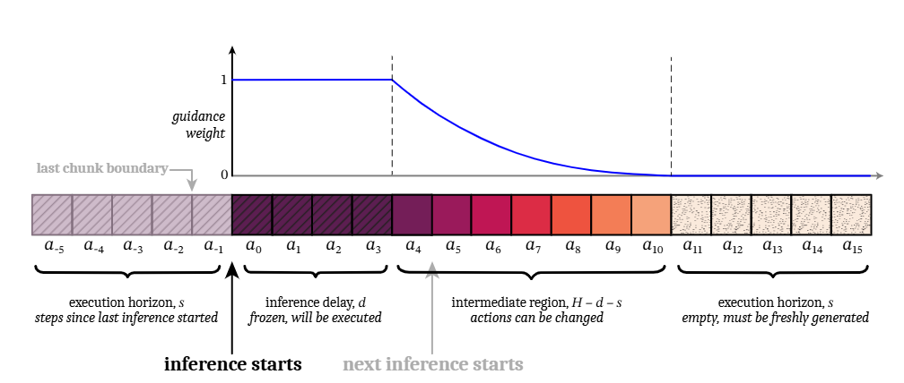

# Pi0.5 with Real-Time Chunking
π₀.₅ (Pi0.5) is a Vision-Language-Action (VLA) model architecture designed by [Physical Intelligence](https://www.pi.website/). It is built upon the PaliGemma VLM backbone, integrating a SigLIP vision encoder (So400m) with a Gemma language model base (e.g., 2.6B parameters) to process multimodal inputs.

Architecturally, π₀.₅ distinguishes itself through a specialized "Action Expert" head — a smaller parameter model (e.g., Gemma 300M) — that generates continuous actions using Flow Matching. Unlike traditional policy heads, this design solves an Ordinary Differential Equation (ODE) from noise to actions, enabling high-precision control.

Key structural features of π₀.₅ include:
-   **AdaRMSNorm Conditioning**: The flow timestep $t$ is injected directly into the normalization layers of the Action Expert via Adaptive RMS Normalization, providing more effective conditioning than standard concatenation.
-   **Discretized State Tokenization**: Robot proprioceptive state is discretized and treated as text tokens within the input prefix, allowing the model to "read" its physical state using the same attention mechanisms as natural language.
-   **Unified Prefix Processing**: Visual patch tokens from SigLIP and text tokens are concatenated into a single sequence, which the transformer processes holistically before passing context to the Action Expert.

<p align="center">
  <br>
  <em>Figure source: <a href="https://arxiv.org/abs/2504.16054">Paper</a> π₀.₅: a Vision-Language-Action Model with Open-World Generalization</em>
</p>

Real-Time Chunking (RTC) is an inference strategy designed to enable high-frequency robotic control with high-latency flow-matching policies (e.g., Pi0, Pi0.5). Based on the application of asynchronous inference execution, RTC employs a unique **Prefix Guidance** mechanism during inference. Instead of blending overlapping chunks after generation (temporal ensembling), RTC uses the unexecuted portion of the previous chunk as a constraint during the flow-matching process. By treating the transition as an inpainting problem, the model is guided to generate new trajectories that seamlessly extend the current motion, ensuring continuous control.

The synergy between Pi0.5 and RTC enables sophisticated generalist control on standard hardware by addressing two critical problems of standard VLA models: **Action Waiting** and **Action Jumping**.
1.  **Eliminating Action Waiting**: RTC runs inference asynchronously in the background while the robot executes buffered actions. This ensures the robot never pauses to "think," maintaining high-frequency control (e.g., 50Hz) despite the model's lower inference speed.
2.  **Preventing Action Jumping**: Through **Prefix Guidance**, RTC treats trajectory generation as an inpainting task. It constrains the start of the new plan to align perfectly with the unexecuted tail of the previous plan, enforcing continuity at the generation level rather than relying on post-hoc smoothing.

<p align="center">
  <br>
  <em>Figure source: <a href="https://arxiv.org/abs/2506.07339">Paper</a> Real-Time Execution of Action Chunking Flow Policies</em>
</p>

This project demonstrates an implementation of Pi0.5 + RTC using the OpenVINO toolkit, specifically accelerating inference on Intel platforms. It provides a comprehensive end-to-end pipeline, covering both MuJoCo simulation for policy validation and a modular workflow for deployment on real ALOHA robots.

## Installation

This project extends the open-source project [LeRobot](https://github.com/huggingface/lerobot) to provide OpenVINO acceleration and Real-Time Chunking (RTC) features on Intel compute platforms. To set up the environment, you need to initialize and patch the submodule:

```bash
git submodule update --init lerobot
cd lerobot
```
Apply the patches:
```bash
git am ../patches/*.patch
```

### Setup Python Environment
Install the packages as prerequisites:
```bash
sudo apt install -y ffmpeg libavcodec-dev libavformat-dev libavutil-dev libavdevice-dev
```

If you would like to use `uv`, you can set up the environment and install dependencies by running:
```bash
uv sync --extra pi-ov
```

> **Usage:** You can run a Python file by using:
> `uv run --extra pi-ov <your_python_file>`.

Alternatively, you can create a Python environment:
```bash
python3 -m venv pi_env
source pi_env/bin/activate
pip install -e .[pi-ov] --extra-index https://download.pytorch.org/whl/cpu
```

## Model Preparation
Running model inference with the OpenVINO toolkit requires converting the model to the OpenVINO IR format.
You can use the [checkpoint](https://eci.intel.com/embodied-sdk-docs/_downloads/checkpoint.tar.gz) finetuned on a simulation task for convenience. 
Alternatively, you can convert your own checkpoints trained using the LeRobot framework.
```bash
cd examples/pi05_with_openvino
```

### Convert Pi0.5 model without RTC
To convert the standard Pi05 model to OpenVINO IR (without RTC support), use the `convert_ov.py` script.

**Arguments:**
- `--torch_dir`: Path to the pretrained PyTorch model checkpoint or the Hugging Face repo. Default: "lerobot/pi05_base"
- `--ov_output_dir`: Directory for saving the OpenVINO IR model.
- `--dataset_path`: (Optional) Path to a local LeRobotDataset directory. If provided, the converter uses dataset stats and the first sample to build real preprocessed inputs (instead of random dummy inputs).
- `--compress_int8`: (Optional) Compress weights to INT8. `nncf` is required.
- `--save_fp32`: (Optional) Save an OpenVINO model in FP32 format (FP16 by default).
- `--override`: (Optional) Overwrite existing files.
- `--camera_num`, `-c`: (Optional) Number of cameras (batch size for image input). Default: 4.

> **Notice**: Using the Pi0.5 model in LeRobot will automatically download the [google/paligemma-3b-pt-224](https://huggingface.co/google/paligemma-3b-pt-224) from Hugging Face. Due to author restrictions, downloading the model requires logging into your Hugging Face account. 
> If you encounter download errors, follow the [instructions](https://huggingface.co/docs/huggingface_hub/quick-start#authentication) on how to log in and authorize your account.

Examples (`uv`):
```bash
uv run --extra pi-ov scripts/convert_ov.py \
    --torch_dir <path_to_pytorch_checkpoint> \
    --ov_output_dir pi05_lerobot_ov_ir \
    --override
```

For using `--compress_int8`, `nncf` is required.
```bash
uv run --extra pi-ov --with nncf scripts/convert_ov.py \
    --torch_dir <path_to_pytorch_checkpoint> \
    --ov_output_dir pi05_lerobot_ov_ir \
    --compress_int8 \
    --override
```

Use a sample from a local LeRobotDataset to generate representative inputs during the export/conversion process:
```bash
uv run --extra pi-ov --with nncf scripts/convert_ov.py \
    --torch_dir <path_to_pytorch_checkpoint> \
    --dataset_path <path_to_local_dataset> \
    --ov_output_dir pi05_lerobot_ov_ir \
    --compress_int8 \
    --override
```

### Convert Pi0.5 model with RTC
To convert the Pi05 model to OpenVINO IR with RTC support, use the `convert_ov_rtc.py` script. The arguments are the same as above.

Examples (`uv`):
```bash
uv run --extra pi-ov --with nncf scripts/convert_ov_rtc.py \
    --torch_dir <path_to_pytorch_checkpoint> \
    --dataset_path <path_to_local_dataset> \
    --ov_output_dir pi05_rtc_lerobot_ov_ir \
    --compress_int8 \
    --override
```

Exported OpenVINO models with RTC require two extra inputs: `prev_chunk_left_over` and `prefix_weights` during inference. 
> **Note**: When it is unnecessary to enable the RTC function (e.g., the first inference step that doesn't have a previous chunk to follow), you can disable RTC by passing zero-tensors to these extra inputs.

## Run Pipeline
### Environment Configuration
Bind the `xe` driver to the iGPU, as it provides better performance than `i915` in this scenario.

- Check the kernel driver in use for the iGPU:
    ```
    lspci -s 00:02.0 -vvv
    ```

- If it does not show "Kernel driver in use: xe", run the following script to bind the `xe` driver:
    ```
    #!/bin/bash
    set -e

    sudo systemctl stop gdm3
    # unbind i915 if "Kernel driver in use: i915" from igpu
    echo 0000:00:02.0 > /sys/bus/pci/drivers/i915/unbind
    # unbind i915 from other devices if have
    # unbind xe from all other devices if have
    # e.g. echo 0000:03:00.0 > /sys/bus/pci/drivers/xe/unbind for dgpu

    # remove i915 module and probe xe module
    rmmod i915
    modprobe -r xe
    echo 0 > /sys/bus/pci/drivers_autoprobe

    # xe driver uses the same firmware with i915
    modprobe xe force_probe=7d51 enable_rc6=0 guc_firmware_path=i915/experimental/mtl_guc_70.bin dmc_firmware_path=i915/experimental/mtl_dmc.bin gsc_firmware_path=i915/experimental/mtl_gsc_1.bin
    # bind igpu to xe
    echo 0000:00:02.0 > /sys/bus/pci/drivers/xe/bind
    # bind other devices to xe if need
    ```


### Inference Benchmarking
Run the `benchmark_pi05_ov_rtc.py` script to benchmark the policy inference pipeline, which includes preprocessing, model inference, and postprocessing. You can find usage examples of the `PI05Policy` with OpenVINO support in the script.

```bash
uv run --extra pi-ov scripts/benchmark_pi05_ov_rtc.py \
    --model_dir <ov_model_dir> \
    --device GPU \
    --chunk_size 75 \
    -n 10
```

**Arguments:**
- `--model_dir`: Directory containing an OpenVINO model (.xml and .bin files).
- `--device`: Target device for inference (e.g., "CPU", "GPU"). Default: "CPU".
- `-n`, `--num_runs`: Number of inference runs to average for benchmarking. Default: 10.
- `--camera_num`, `-c`: Number of cameras used in the model. **This should be the same as the setting used during model conversion**. Default: 4.
- `--chunk_size`: Override the model's chunk_size (and n_action_steps). **This should be the same as the setting of the pretrained checkpoint**. Default: 50.
- `--run_torch`: (Optional) Run the original PyTorch model for output comparison.
- `--torch_dir`: (Optional) Path to the PyTorch model directory for comparison if `--run_torch` is set. Default: "lerobot/pi05_base".
- `--disable_rtc`: (Optional) Disable the RTC functionality when loading a model with RTC. It is invalid when loading a model without the RTC support.

### Evaluation Script Overview

`eval_aloha.py` provides an evaluation script for the ALOHA pipeline that can run:

- **MuJoCo simulation** (`--robot_type mujoco_aloha`) for tasks like `sim_transfer_cube`.
- **Real ALOHA robot** (`--robot_type real_aloha`) for tasks like `transfer_cube`.

#### Arguments:

- `--pretrained_model_path`: Path to the pretrained model checkpoint or the Hugging Face repo ID. Default: `lerobot/pi05_base`.
- `--dataset_path`: (Optional) Local dataset directory used to load metadata (e.g. task language) and, if needed, dataset statistics.
- `--stats_path`: (Optional) Path to `stats.json` used for normalization. If omitted, the script attempts to load `<pretrained_model_path>/stats.json`, falling back to `--dataset_path` if available.
- `--robot_type`: `mujoco_aloha` or `real_aloha`.
- `--task`: Task name, e.g. `sim_transfer_cube`, `sim_insertion`, `transfer_cube`.
- `--num_episodes`: Number of trajectories/episodes to run. Default: `1`.
- `--max_steps`: Max steps per episode. Default: `400`.
- `--fps`: Control Frequency (Hz). Default: `50.0`.

**OpenVINO:**

- `--use_ov`: Use an OpenVINO model for inference.
- `--ov_model_path`: Path to the OpenVINO IR model directory (containing `model.xml` and `model.bin`). Default: `pi05_lerobot_ov_ir_INT8`.
- `--ov_device`: String with an OpenVINO device name (e.g. `CPU`, `GPU`, `GPU.0`). Default: `GPU.0`.

> **Note**: OpenVINO inference still requires `--pretrained_model_path`. It is used to construct the model inputs (preprocessing/tokenization), and determine model/config dimensions (e.g. action space) alongside the OpenVINO model.
> Since dataset statistics are required for normalization, you need to provide them via `--stats_path` (recommended) or `--dataset_path`. If neither is provided, the script will try to load `stats.json` from `--pretrained_model_path`.

**RTC (Real-Time Chunking):**

- `--rtc_enabled`: Enable the RTC algorithm.
- `--rtc_horizon`: Execution horizon for RTC. Default: `45`.

**Visualization/Logging:**

- `--plot`: Enable visualization (typically used with MuJoCo).
> **Note**: If visualization windows do not appear when using `--plot`, install python3-tk to enable the Matplotlib interactive backend: `sudo apt install python3-tk`.
- `--save_traj`: Save trajectory data and plots.
- `--save_traj_path`: Output directory for saved trajectories/plots. Default: `trajectory_plots`.

### Simulation Pipeline

> **Note**: If you encounter MESA warnings, try `sudo apt install mesa-utils libgl1-mesa-dri libglx-mesa0`.

#### Run `sim_transfer_cube` in MuJoCo using an OpenVINO model

```bash
MUJOCO_GL=egl uv run --extra pi-ov examples/aloha/eval_aloha.py \
    --robot_type mujoco_aloha \
    --task sim_transfer_cube \
    --pretrained_model_path <path_to_pretrained_model> \
    --use_ov \
    --ov_model_path <path_to_ov_model>
```

#### Run `sim_transfer_cube` in MuJoCo using an OpenVINO model with RTC

```bash
MUJOCO_GL=egl uv run --extra pi-ov examples/aloha/eval_aloha.py \
    --robot_type mujoco_aloha \
    --task sim_transfer_cube \
    --pretrained_model_path <path_to_pretrained_model> \
    --use_ov \
    --ov_model_path <path_to_ov_model> \
    --rtc_enabled \
    --rtc_horizon 45
```

### Real-robot Pipeline

The real-robot pipeline focuses on running inference on the physical ALOHA hardware.

#### Run `transfer_cube` on a real ALOHA robot using an OpenVINO model

```bash
uv run --extra pi-ov examples/aloha/eval_aloha.py \
    --robot_type real_aloha \
    --task transfer_cube \
    --max_steps 600 \
    --pretrained_model_path <path_to_pretrained_model> \
    --use_ov \
    --ov_model_path <path_to_ov_model>
```

#### Run `transfer_cube` on a real ALOHA robot using an OpenVINO model with RTC

```bash
uv run --extra pi-ov examples/aloha/eval_aloha.py \
    --robot_type real_aloha \
    --task transfer_cube \
    --max_steps 600 \
    --pretrained_model_path <path_to_pretrained_model> \
    --use_ov \
    --ov_model_path <path_to_ov_model> \
    --rtc_enabled \
    --rtc_horizon 45
```

**Tip**: When running OpenVINO inference on Intel platforms, pinning the process to P-cores can help achieve more stable inference performance. For example, prefix your command with `taskset`:
```bash
taskset -c 0-5 uv run --extra pi-ov examples/aloha/eval_aloha.py ...
```
